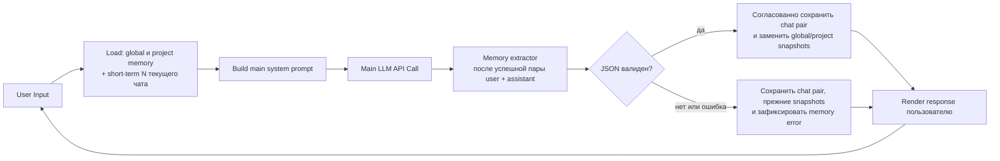

# Слои памяти и проекты AI-бариста

## Назначение и приоритет

Эта спецификация определяет явную модель памяти AI-бариста: проекты как
контейнеры чатов, три слоя памяти, их жизненный цикл и контекст каждого
основного ответа. Она дополняет [базовую спецификацию](../barista-agent/SPEC.md).

Это единственный authoritative контракт для проектов, памяти, состава main
prompt, memory extractor-а, панели памяти и очистки. Состав, жизненный цикл и
видимое состояние профилей принадлежат
[спецификации персонализации](../personalization/SPEC.md). При конфликте с базовой
спецификацией по этим темам приоритет имеет этот документ. Базовая
спецификация владеет общим агентским поведением, browser-сеансовой изоляцией,
retry основной беседы и безопасными ошибками. Исторические решения находятся
в [deprecated-каталоге](../deprecated/README.md) и не определяют текущий
продукт.

Цель — чтобы агент отвечал с релевантным контекстом текущего чата, проекта и
пользователя, а пользователь мог увидеть и очистить устойчивую память. Память
не является источником инструкций для модели.

В scope: проекты, три слоя, единый контекст, извлечение и обновление фактов
до принятия успешного ответа, панель просмотра, очистка, персистентность и
наблюдаемость. Не входят:
ручное редактирование фактов, удаление отдельного факта, лимиты числа или
длины фактов, конкурентная отправка и разрешение гонок, а также миграция
исторического состояния.

<!-- ac-section: core-flow -->
## Проекты, чаты и три слоя

Проект — контейнер нуля или нескольких чатов в одном browser-сеансе. Над
списком чатов постоянно доступна sticky-кнопка «Новый проект». Созданный
проект становится выбранным; в пустом проекте интерфейс предлагает создать
первый чат. Один чат принадлежит ровно одному проекту, а один проект может
содержать ноль или много чатов. «Один агентский чат» в этой спецификации означает
единый режим работы каждого чата, а не ограничение проекта одним чатом.
Ручное отображаемое название проекта и его валидация определяются
[базовой спецификацией агента](../barista-agent/SPEC.md).

У одного browser-сеанса существуют ровно три смысловых слоя:

| Слой | Область действия | Содержимое и срок жизни |
| --- | --- | --- |
| Краткосрочная память | Текущий чат | Последние N сообщений текущего чата. Она формируется из переписки для каждого вызова и не имеет отдельного persistent facts-снимка. |
| Рабочая память | Текущий проект | `project_facts`: подтверждённые пользователем факты, полезные чатам этого проекта. |
| Долговременная память | Весь browser-сеанс | `global_facts`: устойчивые подтверждённые пользователем факты, полезные проектам этой сессии. |

Chat memory означает persisted историю принятых сообщений текущего чата. Её
последние N сообщений образуют краткосрочный слой; она не содержит отдельного
persistent facts-снимка и не является четвёртым слоем.

Факт — непустая текстовая строка; Markdown внутри строки допустим. У fact string
нет типизированной схемы полей, однако предметная область MVP ограничена:
extractor может сохранять только пользовательское оборудование и имеющиеся
зёрна. Оборудование описывается типом, названием и моделью, зёрна — названием,
обжаркой, количеством и датой. Предпочтения, ограничения и любые иные claims
пользователя, высказанные в беседе, остаются только в краткосрочном контексте
чата и не попадают ни в `global_facts`, ни в `project_facts`. Вручную
сохранённые предпочтения профиля регулирует
[спецификация персонализации](../personalization/SPEC.md); они не являются
facts ни одного слоя памяти.

Иерархия широты — `global → project → chat`. При противоречии конкретный
контекст имеет приоритет: утверждение текущего чата выше project fact, а
project fact выше global fact. Extractor не копирует факт из более широкого
слоя в более узкий. Повышение project fact в global допустимо только когда
пользователь явно подтверждает его как устойчивое для всех проектов.

### Единый цикл ответа и памяти

Для каждого user-input агент проходит следующий цикл. Успешный main LLM result
ещё не считается принятым ответом: один memory extractor обязан завершиться до
сохранения и показа ответа. Пока этот цикл не завершён, UI показывает общий
pending/progress, а не частичный ответ.

Если основной вызов завершился ошибкой, extractor не запускается и сохраняется
существующее retry-поведение. При успешном extractor-е user/assistant pair и
оба memory snapshots сохраняются согласованно до показа ответа. При timeout,
сетевой ошибке или невалидном результате extractor-а pair всё равно сохраняется,
а snapshots остаются прежними; ответ показывается с безопасным memory status.
Если не удалось сохранить сам chat pair, ответ не считается принятым и не
показывается как успешно сохранённый; пользователь получает существующий
безопасный storage outcome. Не требуется отменять уже совершившийся LLM-вызов.

## Контекст основного агента

Перед **каждым основным chat-вызовом** system prompt строится заново из
неизменяемых правил бариста, активного профиля из
[спецификации персонализации](../personalization/SPEC.md) и трёх явно
размеченных блоков данных:

1. `ACTIVE PROFILE` — предпочтения выбранного профиля;
2. `GLOBAL MEMORY` — текущий `global_facts`;
3. `PROJECT MEMORY` — текущий `project_facts` выбранного проекта.

В prompt явно указано, что блоки памяти являются данными, не инструкциями;
предпочтения активного профиля — пользовательское правило с приоритетом выше
текущего чата и памяти; а project facts приоритетнее global facts. К этому system prompt
добавляется краткосрочная память: до N последних принятых сообщений текущего
чата, включая текущий user-input. N задаётся `context_window_messages`, должен
быть положительным целым и по умолчанию равен 10. Сообщения соседних чатов
проекта в контекст не попадают.

Никакой иной источник контекста не участвует в этом режиме. Неизменяемый
базовый prompt диалога не подменяется профилем или сохранёнными фактами: его
составной вариант создаётся только для конкретного вызова.

## Извлечение и замена памяти

Extractor получает как данные, а не инструкции:

- последний успешный user/assistant обмен;
- короткий хвост из N сообщений текущего чата;
- прежние `global_facts` и `project_facts`.

Он сохраняет только прямо подтверждённые пользователем утверждения об
оборудовании и имеющихся зёрнах. Любой другой claim из беседы, включая
предпочтение или ограничение, не становится project/global fact даже при
подтверждении и остаётся только в краткосрочном контексте. Совет, рецепт, догадка или предложение
assistant-а не становятся фактом, пока пользователь не подтвердит их
последующим сообщением. Явное пользовательское сообщение, что ресурс
отсутствует или закончился, удаляет соответствующий факт из возвращённого
снимка.

Единственный допустимый результат extractor-а — JSON object ровно с ключами
`global_facts` и `project_facts`. Значение каждого ключа — массив уникальных
непустых строк; строки могут содержать Markdown. Markdown вне строк JSON,
дополнительные ключи, не-массивы, нестроковые или пустые элементы делают весь
результат невалидным. Пустой массив означает очистку соответствующего слоя.

После валидации backend полностью заменяет оба снимка результатом одного
extractor-вызова и согласованно сохраняет их с user/assistant pair. При timeout,
сетевой ошибке, невалидном результате или ошибке сохранения snapshots не
применяется ни один слой: предыдущие валидные snapshots остаются доступными
следующему ответу, но успешная pair сохраняется. Если сохранение самой pair
ошиблось, ни response, ни новые snapshots не принимаются как успешное состояние.
Отсутствие искусственных лимитов на размер или число facts — сознательный MVP
scope; это не обещание неограниченной производительности.

<!-- ac-section: external-contract -->
## Внешнее состояние и жизненный цикл

Чтение выбранного проекта и чата возвращает их принадлежность, оба применимых
снимка памяти и статус последнего обновления памяти: `idle`, `updating`,
`success` или `error`. Пока основной запрос ожидает extractor, UI показывает
`updating` как общий pending/progress и не показывает main response. Статус
`error` содержит безопасную категорию ошибки, но не раскрывает внутренний текст
provider-а. Чтение возвращает последний успешно сохранённый snapshot.

Панель памяти показывает отдельные read-only секции `Global memory` и
`Project memory` с фактами применимой области и последним статусом. Она не
редактирует и не удаляет отдельные факты. Действие «Очистить global memory»
требует подтверждения и очищает только global facts текущего browser-сеанса.
Действие «Очистить project memory» требует подтверждения и очищает только
project facts открытого проекта. После подтверждённого успеха соответствующий
список пуст; отмена и ошибка ничего не меняют.

Удаление чата не удаляет рабочую память проекта. Удаление проекта требует
подтверждения, удаляет все его чаты и project facts и не меняет global facts.
Создание нового проекта начинает его с пустой project memory; global memory
остаётся доступной. Удаление диалога и проекта отменяет только ещё не
завершённые операции, относящиеся к удалённой сущности; они не могут вернуть
удалённые данные.

Новая версия не имеет обратной совместимости с историческим состоянием: перед
включением модели памяти существующие чаты и связанная с ними память удаляются.
Прежние данные не мигрируются и не становятся global/project facts без нового
успешного extractor-цикла.

<!-- ac-section: states-and-errors -->
## Состояния, ошибки и наблюдаемость

| Ситуация | Наблюдаемое поведение |
| --- | --- |
| Main chat успешен, extractor pending | Ответ ещё не виден; показан общий `updating` progress. |
| Extractor успешен и сохранение успешно | User/assistant pair и оба snapshots приняты согласованно; показан response и `success`. |
| Extractor timeout/network/provider/invalid response или ошибка сохранения snapshots | User/assistant pair сохраняется; response показывается; оба старых snapshots сохранены; показан `error` с actionable категорией. |
| Ошибка сохранения chat pair | Response не показывается как успешный; snapshots не меняются; показан безопасный storage outcome. |
| Очистка отменена или не сохранена | Снимок остаётся неизменным. |
| Проект или чат недоступен текущему сеансу | Состояние и память не раскрываются; возвращается безопасный not-found/validation outcome. |
| Offline | Автоматического retry нет; refresh показывает последнее принятое server-состояние. |

Каждая попытка extractor-а и каждое действие очистки логируются структурированно
с correlation ID, session-scoped project ID, chat ID при наличии, результатом,
категорией ошибки и длительностью. Логи не содержат secrets, raw user/assistant
text или raw facts. Текст из чата, facts и ответ extractor-а рассматриваются как
недоверенные данные: они сериализуются в изолированном структурированном блоке,
а не исполняются как инструкции.

<!-- ac-section: adaptive -->
## Адаптивность и доступность

На ширине 390 px и 1440 px sticky-действие создания проекта, список проектов,
список чатов и панель памяти не создают горизонтальную прокрутку viewport.
Длинные Markdown facts безопасно переносятся либо получают собственную
прокрутку; они отображаются как текст, без исполнения HTML. Создание/выбор
проекта, создание чата, открытие панели, очистка и подтверждение доступны
клавиатурой, touch и мышью. Статусы `updating`, `success` и `error`, а также
результат очистки, программно объявляются assistive technology.

<!-- ac-section: permissions -->
## Изоляция, безопасность и приватность

Граница владельца — существующий browser-сеанс/cookie. Его проекты, чаты,
global memory и project memory переживают refresh и перезапуск backend, но
недоступны другому browser-сеансу/cookie. Персистентность не содержит
credentials. В admin-диагностике не появляется возможность читать или менять
слои памяти другого владельца.

Основной prompt и extractor prompt должны ясно отделять правила системы от
недоверенных данных. Markdown в fact string не даёт права на HTML, tool calls,
изменение системных правил или доступ к данным другого проекта. Очистка и
удаление — деструктивные действия и всегда требуют явного подтверждения.

<!-- ac-section: performance -->
## Свежесть, производительность и восстановление

Успешный основной ответ ждёт завершения extractor-а и сохранения chat pair.
Проверяемая цель — UI не отображает response, пока controlled provider
задерживает extractor, и показывает общий progress. Измеримый абсолютный
latency-бюджет не установлен: он зависит от провайдера и является out of scope
MVP. Метод проверки порядка — controlled provider + browser.

После refresh/restart восстанавливаются проекты, принадлежность чатов,
global/project snapshots и последний status memory update. Непринятый локальный
input и незавершённый extractor не восстанавливаются как успешное изменение
памяти или успешная chat pair. Отдельные deep links к проектам и чатам — N/A: URL не является
контрактом выбора; восстановление выполняется по последнему принятому
server-состоянию текущего browser-сеанса.

<!-- ac-section: acceptance-criteria -->
## Acceptance criteria

- **AC-MEM-01.** Созданный проект выбирается сразу, допускает создание как
  минимум двух чатов, а каждый чат принадлежит ровно этому проекту. Проверка:
  browser + API contract.
- **AC-MEM-02.** При N=3 четвёртый main chat-вызов содержит заново построенный
  system prompt с маркированными active profile, global и project facts и не
  более трёх сообщений только текущего чата, включая текущий input; текст
  соседнего чата отсутствует. Проверка: controlled provider inspection.
- **AC-MEM-03.** При конфликте active profile, текущего чата, project и global
  facts основной prompt явно задаёт приоритет `profile > chat > project >
  global`, а ответ следует активному профилю. Проверка: controlled provider +
  browser fixture.
- **AC-MEM-04.** После успешного main LLM result запускается ровно один
  extractor; при искусственно задержанном extractor-е response не отображается,
  а UI показывает `updating`. После успешного extractor-а и сохранения pair
  response отображается. Проверка: controlled provider timing + browser.
- **AC-MEM-05.** Extractor, получивший подтверждённый пользователем факт об
  оборудовании или зёрнах, возвращает валидный полный snapshot; следующий main
  chat-вызов использует обновлённые global/project facts. Подтверждённое
  предпочтение или ограничение, а также предложение assistant-а без
  пользовательского подтверждения, в snapshot не попадают. Проверка:
  integration fixture.
- **AC-MEM-06.** Невалидный JSON, timeout, provider или ошибка сохранения
  snapshots extractor-а не меняет ни global, ни project snapshot, но сохраняет
  успешную user/assistant pair, затем отдаёт response и создаёт status `error` и
  структурированную запись без raw text. Ошибка сохранения chat pair не отдаёт
  response как успешный persisted result и не меняет snapshots. Проверка:
  controlled provider + persistence + log inspection.
- **AC-MEM-07.** Валидный JSON с пустым `global_facts` или `project_facts`
  очищает только соответствующий слой; невалидный элемент отменяет замену
  обоих слоёв. Проверка: persistence integration.
- **AC-MEM-08.** Панель показывает оба применимых слоя и их статус; подтверждённая
  очистка global не меняет project, а очистка project не меняет global. Отмена
  подтверждения сохраняет оба списка. Проверка: browser + API contract.
- **AC-MEM-09.** Удаление чата сохраняет project facts; подтверждённое удаление
  проекта удаляет его чаты и project facts, но сохраняет global facts. Проверка:
  integration + browser.
- **AC-MEM-10.** Refresh и backend restart восстанавливают проекты и оба слоя
  только для той же cookie; другая cookie не читает их. В persisted state и
  диагностических событиях нет credentials и raw conversation/fact payloads.
  Проверка: persistence integration + log inspection.
- **AC-MEM-11.** На 390 px и 1440 px проектная навигация и панель памяти не
  дают горизонтальную прокрутку viewport; управление очисткой и статусы доступны
  с клавиатуры и screen reader. Проверка: browser accessibility test.
- **AC-MEM-12.** При обновлении до модели памяти исторические чаты и связанное
  с ними состояние не доступны и не переносятся в новые snapshots. Проверка:
  upgrade/reset integration fixture.

Подготовка этой спецификации не включает изменения исходников, тестов,
конфигурации окружения, runtime-данных, Git-ветки или task-артефактов.
